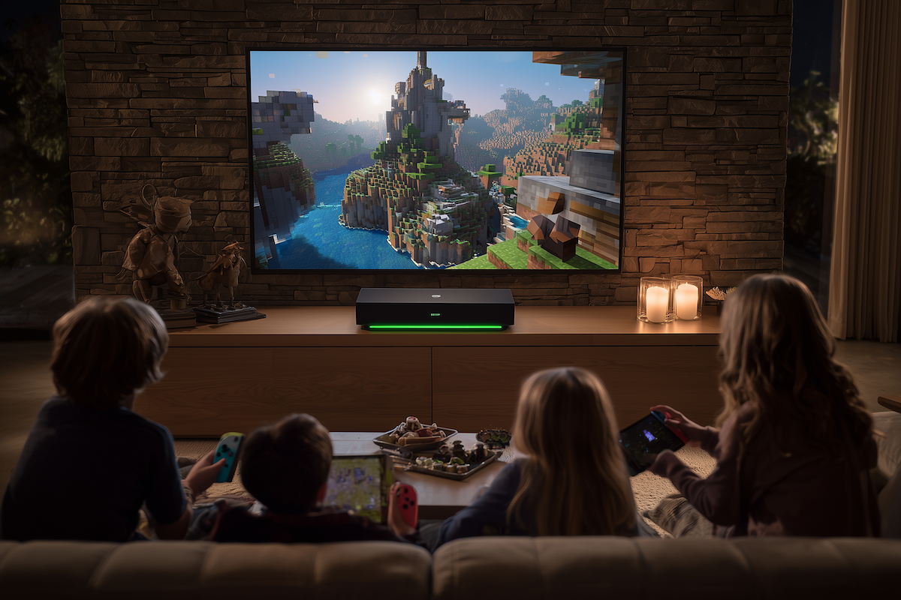

# Nvidia Spark Minecraft Server (so kids could play Minecraft together)

A complete setup guide for running a Minecraft server with cross-platform play (Java + Bedrock) on Nvidia Spark DGX systems. Perfect for local LAN gaming with kids, supporting both PC/Mac (Java Edition) and Nintendo Switch/Mobile (Bedrock Edition) players!

TLDR: Microsoft makes it very difficult to run a Minecraft server on a local network such that both Mac players and Nintendo Switch players could join the same game on different platforms. While it is possible to run a Microsoft server online, on say a Hetzner instance for about $20/months, Nvidia Spark GDX is already an always on Linux computer that is connected to a home network. It seemed like a perfect solution for running a Minecraft server.

Before you begin with the technical setup, be aware that you would need to be the "parent" for your children in the Microsoft ecosystem, and both you and your children need to have a Microsoft account. You would need to update their parental control settings to allow to join and create third party servers. You would also need to pay for Nintendo Switch Online subscription, or the Switch will block your access to external servers.



## Features

- **Cross-platform play**: Java Edition (PC/Mac) and Bedrock Edition (Switch/Mobile/Xbox) on the same server
- **Optimized for Nvidia Spark**: Configured for ARM64 architecture with 12GB RAM allocation
- **Zero-lag local play**: Perfect for family gaming on local network
- **Automatic setup**: Scripts handle all configuration automatically
- **Latest versions**: Always fetches the latest Paper, Geyser, and Floodgate builds

## Prerequisites

- Nvidia Spark DGX system (or any ARM64/x86_64 Linux system)
- Java 17 or higher
- At least 16GB RAM (server allocates 12GB for itself)
- Ubuntu/Debian-based OS
- Network access for downloading server files

## Quick Start

SSH into your Nvidia Spark DGX system (or any ARM64/x86_64 Linux system) and follow the following instructions.

### 1. Clone the Repository

```bash
git clone https://github.com/yourusername/nvidia-spark-minecraft-server.git
cd nvidia-spark-minecraft-server
```

### 2. Run the Setup Script

```bash
chmod +x minecraft-setup.sh
./minecraft-setup.sh
```

This script will:
- Download the latest PaperMC server
- Install GeyserMC and Floodgate for cross-platform support
- Configure all necessary settings
- Set up firewall rules

(If this doesn't work, open a pull request, and let's fix it)

### 3. Configure Server (Optional)

Copy the example configuration:
```bash
cp server.properties.example server.properties
```

Edit `server.properties` to customize:
- `motd=` - Server name shown in multiplayer list
- `level-seed=` - World generation seed
- `gamemode=` - creative/survival/adventure/spectator
- `difficulty=` - peaceful/easy/normal/hard
- `max-players=` - Maximum concurrent players

**Important**: Keep `online-mode=false` for Geyser/Floodgate to work!

### 4. Start the Server

Using screen (recommended):
```bash
screen -S minecraft
java -Xmx12G -Xms12G -jar paper.jar nogui
```

Detach from screen: `Ctrl+A` then `D`
Reattach later: `screen -r minecraft`

Or use the provided start script:
```bash
./start-minecraft.sh
```

The script comes with setup options that allow you to configure the world at each launch, or to relaunch the same world with the same settings. A seed is a starting value that Minecraft's world generation algorithm uses to create your world. Think of it like a recipe or blueprint - the same seed will always generate the exact same world layout. So you can specify your own seed, and keep a list of the worlds you've created. I will probably add a feature to save and load worlds in the future.

What Seeds DO Control:

- Natural terrain generation
- Biome placement
- Natural structure locations (villages, temples)
- Ore placement
- Mob spawner locations in dungeons

What Seeds DON'T Control:

- Player-built structures
- Chest contents (randomized per world)
- Mob spawning (happens dynamically)
- Weather patterns
- Player spawn point (approximate area only)

### 5. Connect to Your Server

Find your server IP:
```bash
hostname -I | awk '{print $1}'
```

#### For Java Edition (PC/Mac):
1. Open Minecraft Java Edition
2. Click "Multiplayer" → "Add Server"
3. Enter your server IP: `[YOUR-IP]:25565`
4. Click "Done" and connect!

#### For Bedrock Edition (Switch/Mobile/Xbox):

Microsoft blocks open Minecraft servers unless you go via one of the known DNSs routes. They say it is for savety.

**Nintendo Switch Setup:**
1. System Settings → Internet → Internet Settings
2. Select your network → Change Settings → DNS Settings → Manual
3. Primary DNS: `104.238.130.180`
4. Secondary DNS: `8.8.8.8`
5. Save and connect

Note: when doing this the first time, you will need to restart your Switch for the changes to take effect. Then, you need to make sure you bought Nintendo Switch Online subscription to activate servers, and then you need to login with your Microsoft account (for whoever is using the Switch) to be able to join the server.

**When inside the Minecraft application**
1. Click Play
2. Go to the Server tab (and wait for a while for it to load)
3. Choose one of the servers taht say "Join to open server"
4. Click "Play" (wait for it to load)
5. Now you can click "Connect to a server" and join yours
6. Use IP: `[YOUR-IP]` and server port `19132`

**How BedrockConnect DNS Works:**

1. When you set DNS to 104.238.130.180, it intercepts Minecraft's connection to featured servers
2. It replaces one of the featured server entries with a "serverlist" server
3. When you join that server, instead of connecting to the game, it shows you a menu where you can add your own custom servers
4. Your custom server details get saved locally on your device

**Alternative DNS Services**

There are (allegedly) several DNS services that provide this workaround:

- 104.238.130.180 - BedrockConnect (most popular)
- 147.135.8.169 - Another BedrockConnect instance
- 173.82.100.84 - BedrockTogether
- 66.85.14.1 - Another alternative

**Security Consideration**

Using these DNS servers means:
- Your Switch's Minecraft traffic goes through their servers first
- They only modify the server list, not gameplay traffic
- Once connected to your local server, traffic is direct
- It's generally safe, but you're trusting a third-party service
  
## Server Management

### Stop the Server
If you are in interactive mode in the server console:
```
stop
```

Or use the script:
```bash
./stop-minecraft.sh
```

### Backup Worlds
```bash
./backup-world.sh
```

### Update Server
Re-run the setup script to get latest versions:
```bash
./minecraft-setup.sh
```

### Add Operators (Admins)
In server console:
```
op [playername]
```

### Whitelist Players

If you don't want Greg from his mom's basement to be joining your kids for a LAN party, I highly recommend whitelisting player names for just your family and your friends. Seems to work, but do test it, and let me know if it doesn't.

```bash
cp whitelist.json.example whitelist.json
```
Edit `whitelist.json` with player names/UUIDs, then:
```
whitelist on
whitelist reload
```

Note: You don't have to provide UUIDs if you don't know them, just player names.

## Performance Tuning

The server is pre-configured for optimal performance on Nvidia Spark:
- **RAM**: 12GB allocated (adjust in start scripts if needed)
- **View Distance**: Set to 5 chunks (good balance)
- **Simulation Distance**: 5 chunks

Bigger chunking was crashing the server and I havent tried to increase it since. It might work.

For more players or larger worlds, edit `server.properties`:
```properties
view-distance=10  # Increase for larger visible area
simulation-distance=10  # Increase for more active chunks
max-players=50  # Allow more players
```

## Troubleshooting

### Server Won't Start
- Check Java version: `java -version` (need Java 17+)
- Ensure enough RAM available
- Check logs: `cat logs/latest.log`

### Can't Connect from Bedrock
- Verify port 19132/UDP is open: `sudo ufw status`
- Check Geyser is running: Look for "Geyser enabled" in logs
- Ensure `online-mode=false` in server.properties

### Switch Can't See Server
- Double-check DNS is set to `104.238.130.180`
- Try restarting Minecraft on Switch
- Manually add server with your local IP and port 19132

### Performance Issues
- Reduce view-distance in server.properties
- Check system resources: `htop`
- Restart server to clear memory

## File Structure

```
nvidia-spark-minecraft-server/
├── minecraft-setup.sh        # Main setup script
├── start-minecraft.sh        # Server start script
├── stop-minecraft.sh         # Server stop script
├── backup-world.sh          # World backup script
├── server.properties.example # Example configuration
├── whitelist.json.example   # Example whitelist
├── .gitignore              # Git ignore rules
└── README.md               # This file
```

## Security Notes

- The server runs with `online-mode=false` to support cross-platform play
- Use whitelist for private servers: `whitelist on`
- Keep firewall enabled and only open required ports
- Never share your `management-server-secret` if using remote management

## Plugin Support

The server uses Paper, which supports Spigot and Bukkit plugins. To add plugins:

1. Download `.jar` files
2. Place in `plugins/` folder
3. Restart server

Recommended plugins:
- EssentialsX - Basic commands and economy
- WorldEdit - Building tools
- LuckPerms - Advanced permissions
- Dynmap - Web-based world map

## Contributing

Contributions are welcome! Please:
1. Fork the repository
2. Create a feature branch
3. Commit your changes
4. Push to the branch
5. Open a Pull Request

## License

MIT License - See LICENSE file for details

## Acknowledgments

- [PaperMC](https://papermc.io/) - High-performance Minecraft server
- [GeyserMC](https://geysermc.org/) - Cross-platform bridge
- [Floodgate](https://github.com/GeyserMC/Floodgate) - Bedrock authentication
- Nvidia Spark community for ARM64 optimization tips

## Support

For issues or questions:
- Open an issue on GitHub
- Check [PaperMC docs](https://docs.papermc.io/)
- Visit [GeyserMC wiki](https://wiki.geysermc.org/)
- It's 2025, just ask your favorite AI; as long as you're nice and polite.

---

**Happy Gaming!** 🎮 Enjoy lag-free Minecraft with your family on Nvidia Spark!
